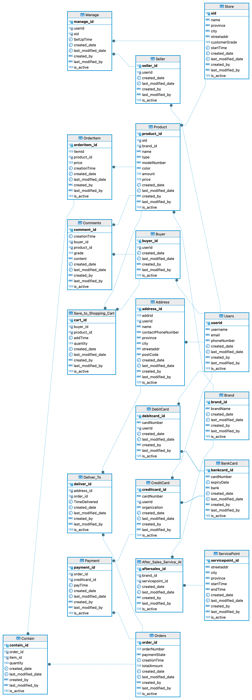

# MySQL Setup Guide

This guide explains how to set up and configure MySQL for the project.

### Prerequisites

Before proceeding, ensure you have the following installed on your system:

- **MySQL Server** (Version `8.x` or higher)
- **MySQL Workbench** or any database client
- Basic knowledge of SQL and MySQL commands

---

### Steps to Set Up the MySQL Database


## A: Clone project in your computer

### 1. Go to the directory, where you want to clone the project in terminal, for ex in document folder

```bash
cd Documents
```


### 2. Clone the Repository
```bash
git clone https://github.com/vipultyagi07/MySQL_PROJECT_online_retail_app.git
```


Now you have the project in your local(computer) folder


## B: Check the mysql server

### 1. Check
```bash
mysql --version
```

#### if above command give no result 

##### for Window follow this 
Ensure that mysql installed on your machine. You can take reference from here [How to install MySQL Server and Workbench](https://youtu.be/Sfvpgu9ID2Q?si=qnpLb3xiiUK8k_H8&t=27).


##### for MacOS follow this
Ensure that mysql installed on your machine. You can take reference from here [How to install MySQL Server and Workbench](https://youtu.be/ODA3rWfmzg8?si=hxReDuQVEddkLqAh).


### 2. Open you MySQL Workbench

connect to the `root` user

## C: Setup the  `online_retail_app` project

There are two-way to set up the project
  1. follow `Step1_create` and  `Step2_InsertQuery`

                OR

  2. follow `StepX`

### 1.  follow `Step1_create` and  `Step2_InsertQuery`

1.1 Open `1_create_DB.sql` and run the script to create the **database**

1.2 Open `2_create_table.sql` and run the script to create the **tables**


1.3 now run the insert query number wise

[1_Users.sql](Step2_InsertQuery%2F1_Users.sql)

[2_Store.sql](Step2_InsertQuery%2F2_Store.sql)

[3_Buyer.sql](Step2_InsertQuery%2F3_Buyer.sql)

[4_Seller.sql](Step2_InsertQuery%2F4_Seller.sql)

[5_BankCard.sql](Step2_InsertQuery%2F5_BankCard.sql)

[6_CreditCard.sql](Step2_InsertQuery%2F6_CreditCard.sql)

[7_DebitCard.sql](Step2_InsertQuery%2F7_DebitCard.sql)

[8_Address.sql](Step2_InsertQuery%2F8_Address.sql)

[9_Brand.sql](Step2_InsertQuery%2F9_Brand.sql)

[10_Product.sql](Step2_InsertQuery%2F10_Product.sql)

[11_OrderItem.sql](Step2_InsertQuery%2F11_OrderItem.sql)

[12_Orders.sql](Step2_InsertQuery%2F12_Orders.sql)

[13_Comments.sql](Step2_InsertQuery%2F13_Comments.sql)

[14_ServicePoint.sql](Step2_InsertQuery%2F14_ServicePoint.sql)

[15_Save_to_Shopping.sql](Step2_InsertQuery%2F15_Save_to_Shopping.sql)

[16_Contain.sql](Step2_InsertQuery%2F16_Contain.sql)

[17_Payment.sql](Step2_InsertQuery%2F17_Payment.sql)

[18_Deliver_To.sql](Step2_InsertQuery%2F18_Deliver_To.sql)

[19_Manage.sql](Step2_InsertQuery%2F19_Manage.sql)

[20_After_Sales_Service.sql](Step2_InsertQuery%2F20_After_Sales_Service.sql)


Now you are all set to do the questions

### 2.  follow `StepX`

create the database manually
```bash
DROP DATABASE IF EXISTS online_retail_app;
```
```bash
create database online_retail_app;
```

Use import functionality 

save this file [order_online_app_import.sql](StepX%2Forder_online_app_import.sql) to some folder and then follow this tutorial


[How to import the whole tables with data](https://youtu.be/q0EBUXTQQRY?si=b4XEQlqupWjHeaE5&t=2)

## D: This is the ER diagram





